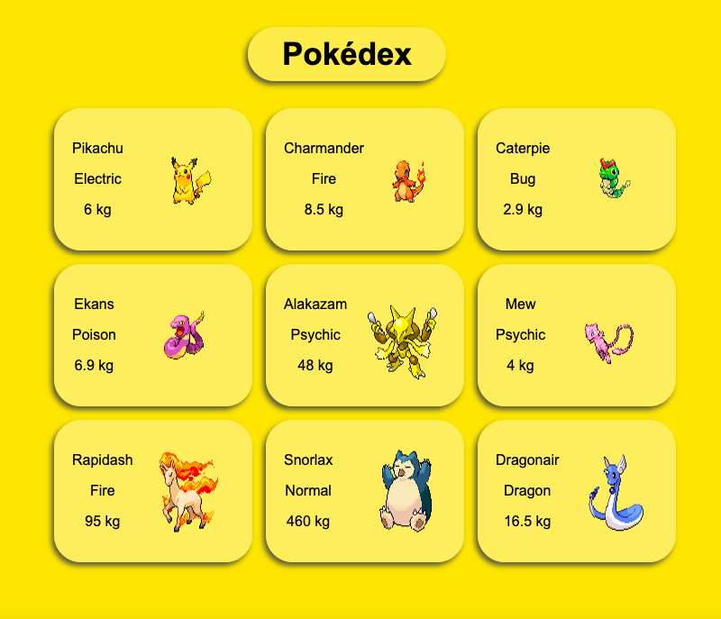

# Pokédex 
##### this project was made just for study purpose.
In this exercise a Pokédex was implemented in a simplified way!
This project has two components:
- Pokedex: This component represents the Pokemon encyclopedia. He receives as input a list of Pokemon to be shown on the screen. For each of these Pokémon received, Pokedex calls the component mentioned below (Pokemon);
- Pokemon: as the name implies, this component represents a Pokémon. It receives as input an object that contains information regarding a specific Pokémon. This component needs to return the following information that will be shown to anyone using the application, this information is validated using PropTypes:
  - pokemon name;
  - pokemon type;
  - Pokémon's average weight, accompanied by the unit of measurement used;
  - Pokemon image.
  
<div align="center" display="inline">
  
</div>

## Run Locally:
- First clone the repository into your machine;

```
git clone git@github.com:GabiNamu/trybewallet.git
```
- Go to the project directory;

```
cd trybewallet
```

- Install dependencies;

```
npm install
```
- Start the server;
```
npm start
```
## Main technologies used:
- React;
- JavaScript;
- Css;
